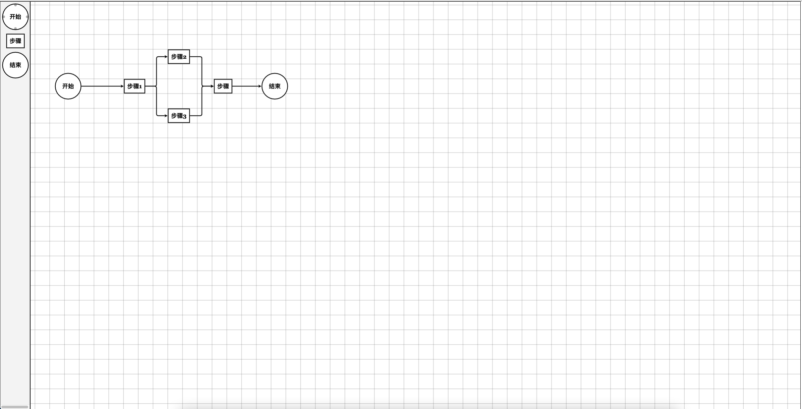
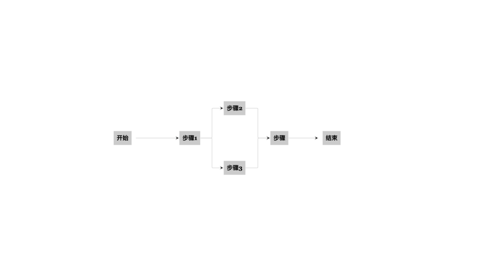

# GoJsDesigner

[在线 demo](https://codepen.io/boboooooo/pen/VwKgNqM)

## 开始使用

- npm 引入

```javascript
import GoJsDesigner from 'gojs-flow-designer'
import 'gojs-flow-designer/lib/gojs-designer.css';

<GoJsDesigner
  :preview="preview"
  @nodeOnClick="nodeOnClick"
  :data="data"
  ref="designer"
>
</GoJsDesigner>
```

- 浏览器引入

```html
<script src="https://unpkg.com/gojs-flow-designer"></script>
<link href="https://unpkg.com/gojs-flow-designer/lib/gojs-designer.css" />

<go-js-designer
  :preview="preview"
  @nodeOnClick="nodeOnClick"
  :data="data"
  ref="designer"
>
</go-js-designer>
```

## 效果展示

- 编辑模式
  

- 预览模式
  

## Props

- data: Object // 流程图 json

- preview: boolean // 是否为预览模式

## Event

- nodeOnClick: (node) => {} // 返回 node 节点信息

## Methods

- getJSON

```javascript
// 获取流程json
this.$refs.designer.getJSON();
```

- redraw

```javascript
// 重新渲染
this.$refs.designer.redraw();
```
